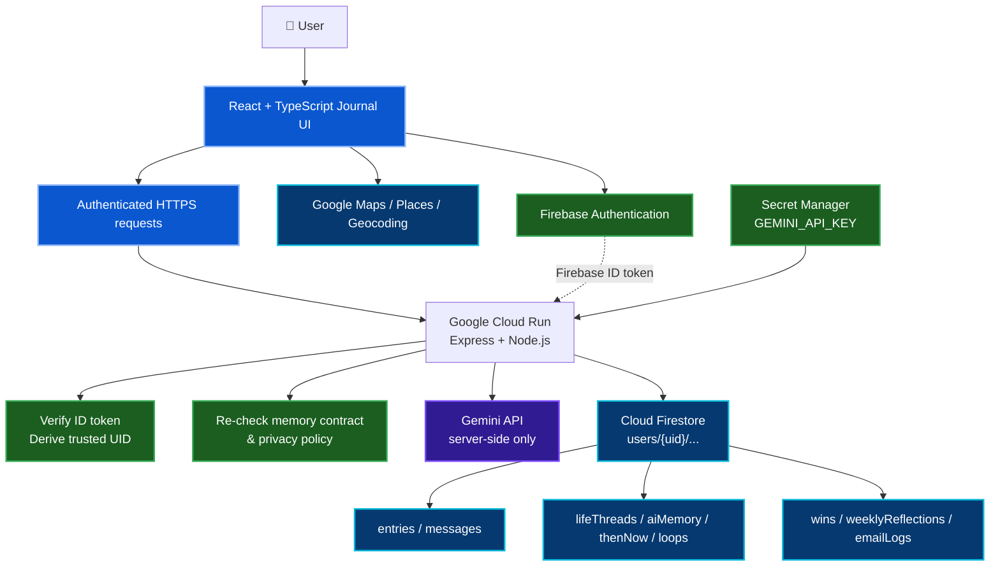

<a id="top"></a>


<div align="center">


<br/>

[](./docs/ARCHITECTURE.md)
[](./docs/SECURITY-AND-PRIVACY.md)
[](./docs/TESTING-AND-RESULTS.md)
[](./evidence/README.md)
[](./docs/DEPLOYMENT.md)

<br/>

> ## **A private living journal that remembers with receipts.**

**Write freely. Decide what AI may use. See how your story connects across time.**

<sub>Built by Sonia Mansha · Google Cloud Gen AI Academy APAC Cohort 3 Ideathon</sub>

</div>


## 🎯 Why I Built This

I did not want to build another chatbot with a diary attached. I wanted to explore whether an AI journal could help someone understand their own story **without taking ownership of it**.

The journal entry remains the user's original writing. Gemini sits behind that experience as an optional reflective layer: it can respond, connect moments across time, surface patterns, and help revisit unfinished threads, but the user decides what may participate in AI reflection and long-term memory.

That question shaped the project:

> **How can AI remember enough to be useful while leaving the user in control of what it is allowed to remember?**

The result is a private journaling application where reflection, memory, voice, place, professional growth, and longitudinal insights are built around explicit privacy choices rather than hidden AI memory.

**Official challenge:** [Secure Personal Gemini Journal — Cloud Run AI Challenge](https://codelabs.developers.google.com/codelabs/cloud-run/cloud-run-ai-challenge)


## 🧩 Challenge Baseline → Final Product

| Secure challenge baseline | What I built beyond it |
|---|---|
| Firebase Authentication | A complete authenticated private-journal experience with desktop/mobile sign-in handling |
| Per-user Cloud Firestore | Owner-scoped journal data plus protected server-derived memory collections |
| Multi-turn Gemini | Reflective Companion with follow-up conversation, structured output, and defensive response cleanup |
| Secret Manager | Server-only Gemini credential injected into the Cloud Run runtime |
| Original enhancement | Living Memory, Memory Receipts, Reflection Lenses, Career Wins, Voice, Maps, Insights, and explicit memory contracts |
| Cloud Run deployment | Dedicated runtime identity, production hardening, post-deployment verification, and regression checks |

The starter challenge established the secure foundation. My work focused on making the journal more personal, explainable, useful across time, and harder to misuse at the browser/server/data boundaries.


## ✨ What Makes the Journal Different

<table>
<tr>
<td width="33%" valign="top">
<h3>🪞 Reflection Lenses</h3>
<p>Reflect on the same moment through <strong>Personal</strong>, <strong>Professional</strong>, <strong>Identity & Growth</strong>, or opt-in <strong>Women & Life</strong> perspectives without changing the original journal entry.</p>
</td>
<td width="33%" valign="top">
<h3>🧠 Living Memory</h3>
<p>Connect user-approved moments into <strong>Life Threads</strong>, <strong>Then & Now</strong> comparisons, and unfinished loops that help reveal how a story changes over time.</p>
</td>
<td width="33%" valign="top">
<h3>🧾 Memory Receipts</h3>
<p>AI-derived connections can point back to the source moments that supported them, making longitudinal memory inspectable rather than invisible.</p>
</td>
</tr>
<tr>
<td width="33%" valign="top">
<h3>🔐 Your Memory, Your Rules</h3>
<p>Each entry can stay <strong>Private Only</strong>, support a <strong>One-Time Reflection</strong>, <strong>Connect with Memories</strong>, or become a prioritized <strong>Core Memory</strong>.</p>
</td>
<td width="33%" valign="top">
<h3>🎙️ Voice & Place</h3>
<p>Capture a moment by voice, transcribe it into the journal, and optionally connect it to a real place through Google Maps, Places, and reverse geocoding.</p>
</td>
<td width="33%" valign="top">
<h3>🏆 Career Wins Vault</h3>
<p>Preserve user-confirmed professional milestones with source provenance, keeping AI suggestions reviewable before they become part of the career record.</p>
</td>
</tr>
</table>

### The signature idea: transparent, permission-based AI memory

The strongest product concept is the combination of **memory contracts + longitudinal connections + memory receipts**. Instead of assuming every journal entry is available to AI forever, the application makes the memory decision explicit and re-checks that policy on the server before sensitive AI-derived actions.


## 🏗️ Architecture



The browser is treated as an untrusted authorization client. Authenticated API routes verify the Firebase ID token, derive the trusted UID server-side, and use that identity for Firestore and AI operations. The Gemini secret never enters the Vite client bundle.

[**Open the detailed architecture →**](./docs/ARCHITECTURE.md)


## 🔐 Security & Privacy by Design

| Boundary | Implemented control |
|---|---|
| **Identity** | Firebase ID tokens are verified server-side before protected API routes derive the UID. |
| **User isolation** | Journal data stays below `users/{uid}` and Firestore rules enforce owner access for browser operations. |
| **Derived AI memory** | Browser clients cannot freely write server-derived collections such as embeddings, life threads, AI memory, weekly reflections, or wins. |
| **Memory policy** | Sensitive AI paths reload stored entry state and re-check the server-side memory contract instead of trusting a client override. |
| **Gemini secret** | `GEMINI_API_KEY` remains server-side and is injected through Secret Manager in Cloud Run. |
| **Prompt boundary** | Retrieved journal entries are treated as untrusted user-authored data, not privileged model instructions. |
| **Response integrity** | Structured model output is parsed and human-facing reflection prose is defensively sanitized before display. |
| **Deletion** | Entry/account deletion also removes related derived-memory artifacts to avoid orphaned connections. |
| **HTTP layer** | CSP, `nosniff`, referrer/permissions policies, and `no-store` on authenticated API responses reduce browser/runtime exposure. |

The Google Maps browser key is intentionally browser-visible because Maps JavaScript executes in the client. Its protection comes from **API restrictions + HTTP referrer restrictions**, not from treating it like the Gemini server secret.

[**Read the security & privacy design →**](./docs/SECURITY-AND-PRIVACY.md)


## 🧪 Verification at a Glance

| Verification | Result |
|---|---:|
| TypeScript | **0 errors** |
| Core security & feature suite | **195 / 195 passed** |
| UX & product-polish suite | **166 / 166 passed** |
| Firestore rules emulator | **14 / 14 passed** |
| Production smoke checks | **13 / 13 passed** |
| Production build | **Success** |

The verification strategy covers authentication, UID isolation, memory contracts, protected derived-memory writes, voice behavior, Maps/location flows, AI response integrity, responsive navigation, compiled production startup, and manual Cloud Run walkthroughs.

[**Open testing & results →**](./docs/TESTING-AND-RESULTS.md)


## 🧾 Evidence Highlights

<table>
<tr>
<td width="50%" valign="top">
<h3>Reflective Companion</h3>

<p>Multi-turn reflection keeps the journal entry primary while Gemini supports follow-up exploration.</p>
</td>
<td width="50%" valign="top">
<h3>Living Memory</h3>

<p>User-approved moments can become connected life threads instead of invisible background memory.</p>
</td>
</tr>
<tr>
<td width="50%" valign="top">
<h3>Insights & Mood Calendar</h3>

<p>Journal history becomes gentle trends and weekly reflection without turning the experience into a scorecard.</p>
</td>
<td width="50%" valign="top">
<h3>Memory Map</h3>

<p>Optional mapped memories connect place with personal context while leaving location under user control.</p>
</td>
</tr>
</table>

[**Browse the complete evidence index →**](./evidence/README.md)


## 🏆 Evaluation Alignment

| Ideathon pillar | Evidence in this project |
|---|---|
| **Authenticity** | Memory Receipts, Life Threads, Then & Now, explicit memory control, Reflection Lenses, Career Wins, Voice, and Maps move the product well beyond the starter experience. |
| **Usability** | Journal-first UI, responsive navigation, onboarding, voice capture, location workflows, calmer insight language, and repaired real-world interaction issues. |
| **Stability** | Type checking, focused regression suites, Firestore emulator tests, production smoke checks, production build validation, and manual Cloud Run walkthroughs. |
| **Security** | Verified Firebase tokens, owner-scoped Firestore, Secret Manager, server-authoritative memory policy, protected derived collections, secure deletion, and defensive AI-output handling. |


## 🛠️ Engineering Journey

The project became most interesting after the initial prototype worked. Small failures appeared at different boundaries—Firestore payloads, structured Gemini output, voice state, Maps behavior, responsive navigation, compiled production startup, and long reflection conversations.

Instead of treating the generated application as one block of code, I had to trace each problem to the layer that owned it and preserve behavior that was already working. That process changed how I thought about AI-assisted development: the speed of generating a prototype is useful, but the deeper engineering work begins when persistence, authentication, browser APIs, model output, security, and deployment all have to behave together.

A few of the most important repairs were:

- removing `undefined` values before Firestore writes and making omission/removal semantics explicit;
- separating Gemini reflection prose from model metadata with a structured output contract;
- turning voice capture into a genuinely voice-first entry flow instead of a text workflow with a microphone attached;
- evolving location from a text label into real Maps place search, current location, reverse geocoding, and mapped memory provenance;
- repairing the production startup path so the compiled Cloud Run runtime reliably serves the built client;
- moving sensitive privacy decisions back to authoritative server-side state;
- adding a dedicated internal scroll controller so long AI conversations remain stable without hijacking the full page.

> **Security controls that exist only in React are UX controls. Authorization and privacy guarantees must be re-established on the server.**

[**Read the troubleshooting & learning journey →**](./docs/TROUBLESHOOTING-AND-LEARNING-JOURNEY.md)


## 🧠 What I Learned

The biggest change in my thinking was moving from **“How do I call Gemini?”** to **“What should Gemini be allowed to remember, infer, and write back?”**

Building memory scopes, longitudinal connections, receipts, protected derived collections, and server-side authorization made the AI-memory problem concrete. I also enjoyed how the interface evolved into something that feels like a journal first: voice, place, mood, professional wins, and reflection are all available, but none of them are required to write a simple moment.

The final application taught me that a polished AI product is not only a model response. It is the interaction between **identity, persistence, model behavior, browser capabilities, security boundaries, failure handling, responsive UX, and cloud deployment**.

> ### **The journal belongs to the user. Gemini can reflect, connect, and remember — within boundaries the user can see and control.**


## ⚠️ Current Boundaries & Possible Enhancements

### Current boundaries

- The Cloud Run web service is public at the HTTP layer; application data still requires Firebase-authenticated API access.
- Some long-term journal intelligence depends on Gemini availability and model behavior, so graceful fallbacks remain important.
- The current prototype is designed around authenticated personal journaling rather than shared or collaborative journals.
- Location is optional and should remain opt-in; custom labels are kept distinct from verified map places.
- AI-derived professional wins remain suggestions until the user reviews and confirms them.

### Possible enhancements

- deterministic server-side audit timestamps for all system-of-record metadata;
- richer observability for Gemini retries, derived-memory operations, and privacy-sensitive actions;
- more automated adversarial testing for prompt injection and memory-policy bypass attempts;
- stronger abuse/rate controls if the public prototype becomes a broader service;
- optional encrypted export/import workflows and additional data-portability formats;
- code-enforced feature authorization for any future high-impact external integrations.


## 💻 Technology Stack

| Layer | Technology |
|---|---|
| Frontend | React 19, TypeScript, Vite, Tailwind CSS |
| Backend | Express, Node.js 22 |
| Authentication | Firebase Authentication with Google Sign-In |
| Database | Cloud Firestore |
| AI | Google Gemini API via `@google/genai` |
| Maps | Maps JavaScript API, Places API (New), Geocoding API |
| Deployment | Google Cloud Run source deployment / Google Cloud Buildpacks |
| Runtime identity | Dedicated Cloud Run service account + Application Default Credentials |
| Secrets | Google Secret Manager |


## 🗂️ Repository Guide

```text
.
├── src/                         # React application
├── public/                      # Static public assets
├── tests/                       # Security, feature, UX and regression tests
├── docs/
│   ├── ARCHITECTURE.md
│   ├── SECURITY-AND-PRIVACY.md
│   ├── TESTING-AND-RESULTS.md
│   ├── TROUBLESHOOTING-AND-LEARNING-JOURNEY.md
│   ├── DEPLOYMENT.md
│   └── FIRESTORE.md
├── evidence/
│   ├── README.md
│   └── images/
├── server.ts                    # Express backend + Gemini + Firebase Admin
├── firestore.rules             # Production Firestore Security Rules
├── firebase.json               # Firestore rule deployment mapping
├── firebase-applet-config.json # Firebase Web SDK client configuration
├── package.json
├── package-lock.json
├── Procfile
├── .env.example
└── README.md
```

### Deep documentation

| Document | Focus |
|---|---|
| [`ARCHITECTURE.md`](./docs/ARCHITECTURE.md) | System boundaries, request flows, memory flows, deployment model |
| [`SECURITY-AND-PRIVACY.md`](./docs/SECURITY-AND-PRIVACY.md) | Authentication, Firestore isolation, secrets, memory-policy enforcement, deletion |
| [`TESTING-AND-RESULTS.md`](./docs/TESTING-AND-RESULTS.md) | Automated suites, emulator checks, production verification |
| [`TROUBLESHOOTING-AND-LEARNING-JOURNEY.md`](./docs/TROUBLESHOOTING-AND-LEARNING-JOURNEY.md) | Real failures, repairs, verification, lessons |
| [`DEPLOYMENT.md`](./docs/DEPLOYMENT.md) | Cloud Run source deployment, IAM, Secret Manager, Maps/Firebase post-deploy setup |
| [`FIRESTORE.md`](./docs/FIRESTORE.md) | Data model, named database configuration, Firestore rules |
| [`evidence/README.md`](./evidence/README.md) | Final product and troubleshooting evidence index |


## 🚀 Run & Verify Locally

<details>
<summary><strong>Open local setup</strong></summary>

### Prerequisites

- Node.js **22.x**
- npm
- Firebase project with Google Sign-In enabled
- Firestore database
- Gemini API key
- Optional restricted Google Maps browser key

### Install

```bash
npm ci
```

### Configure

```bash
cp .env.example .env
```

Set the local values described in `.env.example`. Do **not** commit `.env`.

### Run

```bash
npm run dev
```

Open `http://localhost:3000`.

### Verify

```bash
npm run typecheck
npm test
npm run build
```

Or:

```bash
npm run verify
```

</details>

For the full Cloud Run deployment, IAM, Secret Manager, Firebase Authorized Domains, Firestore rules, and Maps restrictions, use [`docs/DEPLOYMENT.md`](./docs/DEPLOYMENT.md).


## 🎥 Demo & Public Project

The final product walkthrough and build story were published on LinkedIn as part of the Ideathon submission, alongside the public source repository and the deployed Cloud Run prototype.

- **LinkedIn project post:** https://lnkd.in/p/gMbganBW


## 👩‍💻 About Me

**Sonia Mansha**

I work across **Cloud Security, Cybersecurity, DevSecOps, automation, and secure GenAI engineering**. This project gave me a chance to combine those interests in one application: not only building an AI experience, but tracing the identity, data, memory, secret, browser, and deployment boundaries that make the experience trustworthy.

[LinkedIn](https://www.linkedin.com/in/sonia11mansha415/) · [GitHub](https://github.com/sonia11mansha415) · [Academy Portfolio](https://github.com/sonia11mansha415/google-cloud-genai-academy-apac-cohort-3)


## 📚 Attribution

The Google Cloud Gen AI Academy APAC Cohort 3 Ideathon codelab provided the secure challenge baseline and mandatory submission requirements. This repository documents my completed product design, feature expansion, implementation, testing, hardening, deployment, troubleshooting, and engineering lessons.

See [`ATTRIBUTION.md`](./ATTRIBUTION.md) for concise source attribution.

---

<div align="center">

### **Write honestly. Remember with permission. Reflect with context.**

**Personal Gemini Journal · Sonia Mansha**

[↑ Back to top](#top)

</div>


