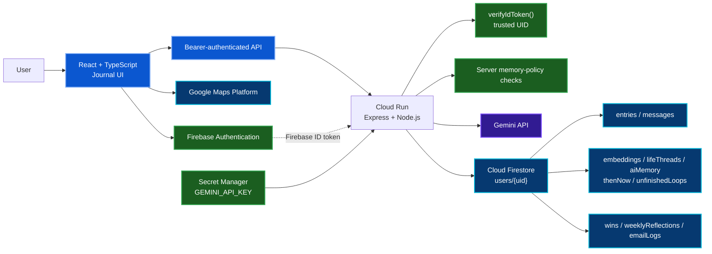

<a id="top"></a>

[🏠 Project Home](../README.md) · [🔐 Security & Privacy](./SECURITY-AND-PRIVACY.md) · [🧪 Testing & Results](./TESTING-AND-RESULTS.md) · [🚀 Deployment](./DEPLOYMENT.md)

# 🏗️ Architecture

Personal Gemini Journal separates the **journal experience**, the **trusted application backend**, and the **user-owned data boundary** so that browser state does not become the source of truth for authorization or AI-memory policy.


## System Overview



## Trust Boundaries

| Boundary | Trusted source | Design decision |
|---|---|---|
| User identity | Verified Firebase ID token | The backend derives the UID from the verified token instead of trusting a UID sent by the browser. |
| Journal ownership | `users/{uid}` + Firestore rules | Browser reads/writes stay inside the signed-in user's ownership boundary. |
| AI eligibility | Stored entry memory contract | Sensitive AI paths reload the authoritative entry before deciding whether the content may be used. |
| Gemini credential | Secret Manager / Cloud Run runtime | The server key never enters the browser bundle. |
| Maps browser key | Restricted browser key | The key is visible by design, so API scope and HTTP referrers provide the protection. |
| Derived memory | Cloud Run server | Browser clients can read permitted derived results but cannot freely forge server-derived memory records. |

## Authentication Flow

```text
Google Sign-In
   ↓
Firebase Authentication
   ↓
Browser receives Firebase ID token
   ↓
Authorization: Bearer <token>
   ↓
Cloud Run / Express
   ↓
Firebase Admin verifyIdToken()
   ↓
Trusted UID derived server-side
   ↓
User-scoped Firestore / AI action
```

The server does not treat a client-provided UID as an authorization boundary.

## Journal Persistence Flow

```text
Journal editor
   ↓
Authenticated API request
   ↓
Trusted UID
   ↓
Sanitize optional Firestore fields
   ↓
/users/{uid}/entries/{entryId}
   ↓
Memory contract synced
   ↓
Derived memory updated or pruned as needed
```

Entry deletion also removes nested messages and related derived-memory records so deleted source material does not remain connected through stale AI artifacts.

## Reflection Flow

```text
Journal entry + chosen lens
   ↓
Server verifies identity
   ↓
Reload stored entry + memory contract
   ↓
STORE_ONLY? ── yes ──> reject AI reflection
   │
   no
   ↓
Retrieve allowed connected memories when applicable
   ↓
Insert memories as untrusted journal data
   ↓
Gemini structured reflection response
   ↓
Parse metadata + sanitize human-facing prose
   ↓
Return reflection to journal UI
```

This keeps model metadata and human-facing reflection prose separate and prevents retrieved journal text from becoming privileged system instructions.

## Living Memory Flow

Entries can use four memory contracts:

| Contract | AI now | Future connections |
|---|---:|---:|
| `STORE_ONLY` | No | No |
| `PAGE_ONLY` | Yes | No |
| `MAY_CONNECT` | Yes | Yes |
| `IMPORTANT_MEMORY` | Yes | Yes, prioritized |

Connectable memories can support:

- Life Threads;
- Then & Now comparisons;
- unfinished loops;
- AI memory records;
- source-backed Memory Receipts;
- Career Wins and weekly reflection flows where the server policy allows them.

Downgrading an entry to a non-connectable memory contract prunes related derived-memory artifacts.

## Voice Flow

```text
Microphone permission
   ↓
Browser MediaRecorder
   ↓
Audio validation / payload limit
   ↓
Authenticated transcription route
   ↓
Gemini transcription
   ↓
Journal text + voice marker
```

Silence/cancellation does not create a fake journal entry. Recording resources are released when the flow ends or the active entry changes.

## Maps & Location Flow

The location model distinguishes three cases:

1. **Current location** — coordinates from the browser followed by reverse geocoding.
2. **Verified place** — Places autocomplete + place details + coordinates.
3. **Custom label** — user text that remains distinct from a verified geographic point.

The Memory Map uses the same stored location model, so place provenance is preserved instead of treating every label as a confirmed map location.

## Production Build & Deployment

```text
Git repository
   ↓
gcloud run deploy --source .
   ↓
Google Cloud Buildpacks
   ↓
npm run gcp-build
   ├── Vite → dist/client
   └── esbuild → dist/server.cjs
   ↓
Cloud Run
   ├── dedicated runtime service account
   ├── GEMINI_API_KEY ← Secret Manager
   └── Firestore ← ADC / service identity
```

Express serves only the built client directory. The compiled server bundle and source/config files are not exposed as public static content.

## Main Failure Boundaries

| Layer | Example failure | Verification approach |
|---|---|---|
| Browser | responsive navigation / media state | focused UX tests + manual viewport testing |
| Authentication | missing/invalid Firebase token | protected-route tests |
| Firestore | invalid optional field / ownership violation | sanitization tests + emulator rules |
| Gemini | malformed structured output / truncation | output parser, retry and sanitizer tests |
| Maps | loader / geocoding / place provenance | Maps helper tests + manual workflow |
| Cloud Run | compiled server/client mismatch | production smoke checks + live walkthrough |

---

[🏠 Project Home](../README.md) · [🔐 Security & Privacy](./SECURITY-AND-PRIVACY.md) · [🧪 Testing & Results](./TESTING-AND-RESULTS.md) · [↑ Back to top](#top)
