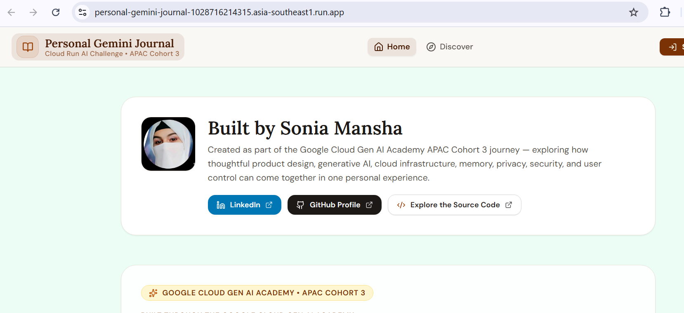

<a id="top"></a>

[🏠 Project Home](../README.md) · [🏗️ Architecture](./ARCHITECTURE.md) · [🔐 Security & Privacy](./SECURITY-AND-PRIVACY.md) · [🧾 Evidence](../evidence/README.md)

# 🧪 Testing & Results

Testing expanded with the product. The final verification set combined TypeScript checks, focused regression suites, Firestore Security Rules emulator checks, compiled-runtime smoke tests, production build validation, and manual testing against the deployed Cloud Run application.


## Verification Summary

| Verification | Result | Coverage |
|---|---:|---|
| TypeScript | **0 errors** | Frontend, backend, shared types, and test code |
| Core security & feature suite | **195 / 195 passed** | Auth guards, UID isolation, memory contracts, protected derived data, Career Wins, export/deletion, API behavior |
| UX & product-polish suite | **166 / 166 passed** | Voice flow, Maps helpers, responsive navigation, reflection sanitization, conversation scrolling, product behavior |
| Firestore rules emulator | **14 / 14 passed** | Owner isolation, permitted client writes, denied server-derived writes, default-deny paths |
| Production smoke checks | **13 / 13 passed** | Compiled server startup, static client assets, health endpoint, protected source/config paths |
| Production build | **Success** | Vite client bundle + Node server bundle |

## Main Verification Commands

```bash
npm run typecheck
npm test
npm run build
```

Or run the repository verification chain:

```bash
npm run verify
```

## Acceptance Areas

### Authentication & user isolation

| Test | Expected | Observed | Status |
|---|---|---|---|
| Unauthenticated protected API call | Reject request | Request rejected | ✅ PASS |
| Malformed/expired Firebase token | Reject request | Request rejected | ✅ PASS |
| Browser-supplied UID mismatch | Server ignores client UID as trust source | UID derived from verified token | ✅ PASS |
| Cross-user Firestore access | Denied | Emulator rules enforce owner boundary | ✅ PASS |
| Browser write to server-derived collections | Denied | Emulator rules deny write paths | ✅ PASS |

### Memory-policy privacy

| Test | Expected | Observed | Status |
|---|---|---|---|
| `STORE_ONLY` reflection | No Gemini reflection | Server rejects AI reflection | ✅ PASS |
| `PAGE_ONLY` entry | Reflect now, no future connected memory | Reflection allowed; connectable memory not persisted | ✅ PASS |
| `MAY_CONNECT` / `IMPORTANT_MEMORY` | Eligible for longitudinal connections | Retrieval/derived-memory paths enabled | ✅ PASS |
| Client tries to override memory policy | Stored policy remains authoritative | Server reloads entry before sensitive action | ✅ PASS |
| Entry downgraded to non-connectable | Derived memory removed | Embedding/connection pruning runs | ✅ PASS |

### AI response integrity

- reflection prose is separated from structured metadata;
- fenced/malformed model output is cleaned before display;
- short user messages remain unchanged;
- retry messages are deduplicated;
- truncated output can be retried and trimmed to complete-sentence boundaries;
- human-facing reflection text does not expose internal JSON/schema material.

### Voice journaling

- strict audio MIME and payload-size checks;
- a voice-first journal entry can be created without a typed dummy draft;
- silence/cancellation does not create a fake entry;
- recorder resources are released cleanly;
- state resets when switching journal entries;
- temporary transcription failure leaves the journal usable for typing.

### Maps & location

- current-location flow obtains fresh coordinates;
- reverse geocoding turns coordinates into a readable place label;
- Places search uses the current autocomplete flow;
- verified mapped places retain coordinates;
- custom labels remain distinguishable from verified places;
- Memory Map consumes the same location model.

### UX & responsiveness

- public and authenticated navigation states remain intentional;
- navbar behavior is stable across constrained desktop/tablet/mobile widths;
- Living Memory controls use deliberate responsive layouts;
- long reflection conversations scroll inside the conversation pane rather than moving the full page;
- manual upward reading disables auto-stick until a new send/retry;
- reduced-motion preferences are respected where the interaction depends on motion.

## Manual Production Verification

After Cloud Run deployment, the final application was exercised through the user-facing paths intended for the demo:

1. Google sign-in;
2. create a typed journal entry and reload;
3. reflect with Gemini and continue a follow-up turn;
4. record and transcribe a voice entry;
5. use place search/current location;
6. inspect Memory Map;
7. discover Living Memory connections;
8. verify mood/insight updates;
9. review Career Wins;
10. save settings and reload;
11. export journal data.

### Production home



The final application is served from Google Cloud Run and was manually exercised after the final stability/hardening work.

## Why the Test Strategy Matters

The application crosses several failure boundaries: browser state, Firebase Authentication, Firestore rules, Admin SDK writes, Gemini calls, browser media, Maps APIs, and the Cloud Run runtime. A successful page load would not prove those boundaries independently.

The test strategy therefore follows the same principle used during debugging: identify the layer that owns the behavior, validate that layer directly, and then return to the complete end-to-end user flow.

---

[🏠 Project Home](../README.md) · [🛠️ Troubleshooting](./TROUBLESHOOTING-AND-LEARNING-JOURNEY.md) · [🧾 Evidence](../evidence/README.md) · [↑ Back to top](#top)
