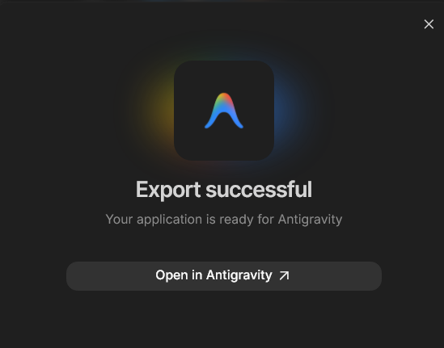
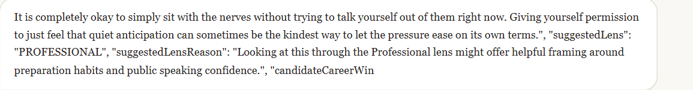
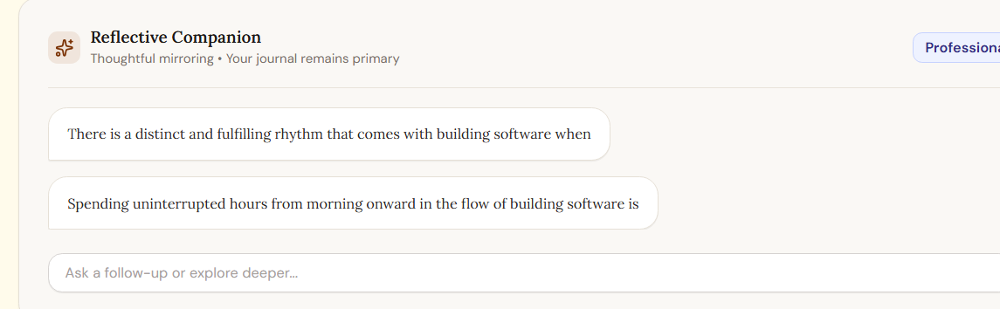
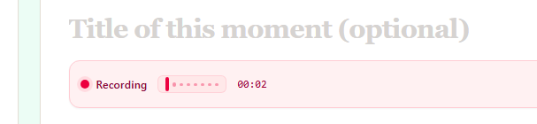

<a id="top"></a>

[🏠 Project Home](../README.md) · [🏗️ Architecture](./ARCHITECTURE.md) · [🔐 Security & Privacy](./SECURITY-AND-PRIVACY.md) · [🧪 Testing & Results](./TESTING-AND-RESULTS.md) · [🧾 Evidence](../evidence/README.md)

# 🛠️ Troubleshooting & Learning Journey

The first working version proved the idea quickly. The deeper engineering work started when the prototype had to persist safely, keep Gemini output clean, survive production builds, behave across screen sizes, respect per-entry privacy choices, and remain usable when one integration failed.

The most useful debugging shift was learning to isolate the failing layer instead of treating every visible symptom as “the app is broken.” The layers were often different: **UI state, Firestore payloads, Gemini response contracts, browser media, Maps integration, authentication, or the Cloud Run runtime**.


## 1. From rapid prototyping to code-level stabilization

Google AI Studio helped me move quickly from a concept to an interactive starting point. Once the product grew, the work shifted toward reading the codebase, tracing state, tightening server boundaries, adding regression tests, and repeatedly building the exact production artifacts.



**Lesson:** an AI-generated starting point still needs conventional engineering discipline: inspect, reproduce, isolate, repair, test, then continue.

## 2. Optional Firestore fields were not optional at runtime

### Symptom

A normal reflection flow failed on an entry without a location because Firestore received `location: undefined`.


### Root cause

Several client update paths spread a complete entry object into Firestore writes. JavaScript represented an unset optional field as `undefined`, but Firestore does not accept `undefined` as a stored field value.

### Fix

I hardened the write boundary instead of patching one field:

- absent optional locations are omitted;
- explicit field removal uses a deletion sentinel;
- reflection writes update the conversation delta rather than re-writing the complete draft;
- a centralized Firestore sanitizer recursively removes accidental `undefined` values while preserving valid Firestore sentinels.

### Verification

The same journal/reflection path completed without the Firestore serialization error, and the focused tests covered optional-field sanitization.

### Lesson

**Typed optional fields are not enough. Persistence boundaries need runtime sanitization and explicit update semantics.**

## 3. Gemini metadata leaked into human-facing reflection prose

### Symptom

Gemini sometimes returned reflection text together with structured fields such as lens and Career Win metadata. Raw JSON fragments appeared beside the natural-language response.



### Root cause

The earlier reflection path relied too heavily on free-form model output and regex cleanup. When the response shape changed, part of the metadata survived into display text.

### Fix

I redesigned the response boundary:

- Gemini returns `application/json` against a response schema;
- the server parses reflection prose and metadata into separate fields;
- the client applies a second defensive sanitizer before rendering assistant prose;
- suggested lenses and Career Win candidates render as separate user-controlled UI elements;
- user messages remain verbatim and are never passed through the assistant-prose sanitizer.

### Verification



The visible multi-turn conversation renders clean prose while structured metadata stays outside the assistant message.

### Lesson

**Structured model output should be treated like an API response, not trusted as display-ready text.**

## 4. Voice journaling had to become genuinely voice-first

Microphone access alone did not make the journal voice-first. The complete path needed predictable behavior for recording, silence, cancellation, transcription, state changes, persistence, and cleanup.

The stabilization work added:

- local waveform feedback;
- recording timer and clear transcribing state;
- stream/audio-context cleanup;
- cancellation that discards buffered audio and temporary state;
- speech-energy/silence guards;
- server-side transcription validation;
- suggested titles based on actual speech;
- state isolation when switching entries.



### Lesson

**A voice feature is complete when recording, silence, cancellation, transcription, persistence, and cleanup all have defined states.**

## 5. Responsive navigation exposed real layout assumptions

### Symptom

During viewport and zoom testing, the desktop navigation collided with the brand area. Icons and button edges were visibly clipped.


### Fix

I rebuilt the header as an intentional responsive layout:

- brand, navigation, and user actions became separate regions;
- desktop uses a non-wrapping row with explicit priorities;
- lower-priority text hides before navigation becomes unreadable;
- compact widths switch intentionally to a second navigation row;
- public and authenticated navigation expose different tab sets.


### Lesson

**Responsive design is not shrinking until everything fits. The layout needs explicit priorities and breakpoint behavior.**

## 6. Maps evolved from a label field into a real location workflow

The first location concept behaved more like a text label than a Maps feature. The final workflow separates three user intents:

1. use the device's current coordinates;
2. select a real place from Maps suggestions;
3. save a personal custom label without claiming verified coordinates.

The finished path centralizes Google Maps loading, uses the current Places autocomplete flow, reverse-geocodes GPS coordinates, preserves real coordinates for mapped places, keeps custom labels distinct, and lets Memory Map consume the same location model.

### Lesson

The useful fix was not another input box. It was **making location provenance explicit in both the data model and the UX**.

## 7. Production startup exposed a compiled-runtime mismatch

### Symptom

A production bundle could compile successfully and still show a blank experience if the server entered its development branch while running the already-compiled bundle.

### Root cause

The earlier server behavior depended too narrowly on a development/production environment flag.

### Fix

The runtime now detects execution from the compiled server path as a production condition. Vite is dynamically loaded only during development, client assets build to `dist/client`, and Express serves only that directory.

The hardening pass also added protected source/config paths and smoke tests that start the exact compiled server before requesting real built assets.

### Verification

The production smoke suite passed and the deployed Cloud Run service was exercised through the final user walkthrough.

### Lesson

**A successful build is only one checkpoint. The production start path has to be tested the way production actually starts it.**

## 8. Server-authoritative privacy checks replaced client trust

As the AI features expanded, a recurring architectural question appeared: should the server trust the entry content or memory contract sent by the browser?

The answer became consistently **no** for sensitive actions.

For flows such as Career Win extraction and reflection eligibility, the server reloads the authoritative stored entry under the authenticated user's UID before deciding whether the content may participate in AI processing. Client overrides are not accepted as the trust source.

### Lesson

**Security controls that exist only in React are UX controls. Authorization and privacy guarantees must be re-established on the server.**

## 9. Reflection conversation stability needed a dedicated scroll controller

Long conversations exposed a smaller but important UX failure: a new user turn or assistant reply could appear below the internal message viewport, forcing manual scrolling and making the conversation feel unreliable.

The final controller:

- sticks to the bottom after a new send;
- waits for React layout before measuring scroll height;
- scrolls only the internal conversation panel;
- releases the lock when the user intentionally scrolls upward;
- re-engages on send/retry;
- respects reduced-motion preferences;
- resets when the active entry changes.

### Lesson

**Interaction stability is part of product correctness, not only visual polish.**

## Debugging Pattern I Carried Forward

```text
Capture the exact symptom
        ↓
Identify which layer owns it
        ↓
Reproduce the smallest failing path
        ↓
Protect already-working behavior
        ↓
Make one focused architectural repair
        ↓
Type-check / run focused regression tests
        ↓
Build the production bundle
        ↓
Return to end-to-end manual testing
```

The project had many iterations where one fix exposed another edge case. The useful part was not avoiding those moments; it was refusing to solve them with shortcuts that weakened privacy, isolation, or deployment behavior.

By the end of the challenge, the most important lesson was seeing how **AI behavior, persistence, authentication, browser APIs, responsive UX, and Cloud Run deployment meet at product boundaries**.

---

[🏠 Project Home](../README.md) · [🧪 Testing & Results](./TESTING-AND-RESULTS.md) · [🔐 Security & Privacy](./SECURITY-AND-PRIVACY.md) · [🧾 Evidence](../evidence/README.md) · [↑ Back to top](#top)
