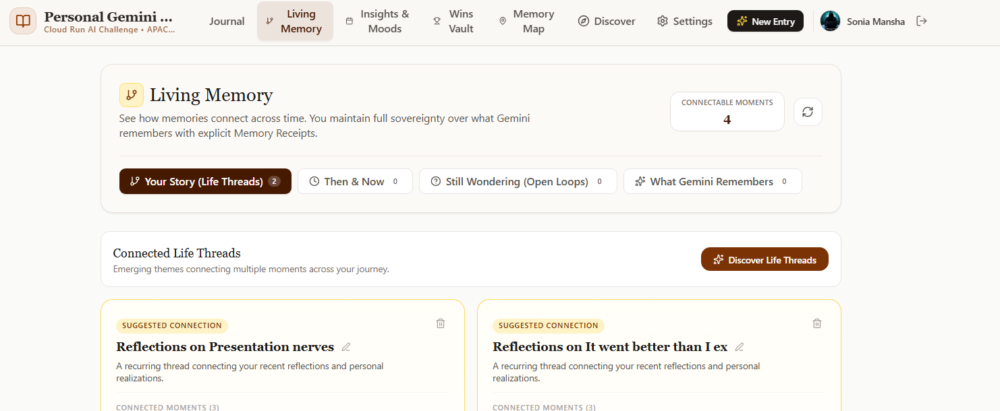
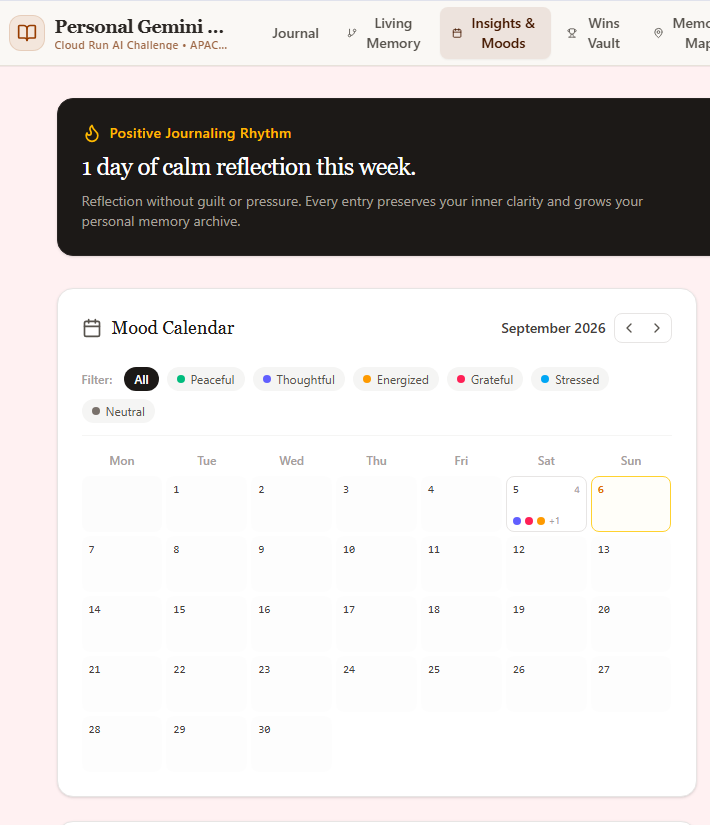
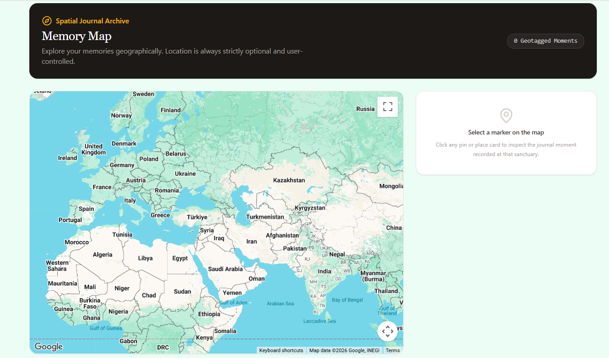

[🏠 Project Home](../README.md) · [🧪 Testing & Results](../docs/TESTING-AND-RESULTS.md) · [🛠️ Troubleshooting](../docs/TROUBLESHOOTING-AND-LEARNING-JOURNEY.md)

# 🧾 Evidence Index

## Final Product

| File | What it proves |
|---|---|
| [`01-live-cloud-run-home.png`](./images/final/01-live-cloud-run-home.png) | Final application running from Google Cloud Run |
| [`02-reflective-companion-multiturn.png`](./images/final/02-reflective-companion-multiturn.png) | Multi-turn Gemini reflection while the journal remains primary |
| [`03-voice-recording-waveform.png`](./images/final/03-voice-recording-waveform.png) | Voice-first recording state with waveform and timer feedback |
| [`04-living-memory-life-threads.png`](./images/final/04-living-memory-life-threads.png) | Living Memory and Life Thread connections across user-approved moments |
| [`05-insights-mood-calendar.png`](./images/final/05-insights-mood-calendar.png) | Journaling rhythm, mood calendar, and insight surface |
| [`06-memory-map.png`](./images/final/06-memory-map.png) | Google Maps-backed Memory Map with optional location journaling |
| [`07-career-wins-vault.png`](./images/final/07-career-wins-vault.png) | Career Wins Vault for reviewed professional milestones |

### Reflective Companion

The journal supports follow-up reflection while preserving the original user-written moment as the source context.

### Living Memory

Connectable moments can become Life Threads and other longitudinal structures under explicit user memory choices.

### Insights & Moods

Journal history becomes gentle patterns and weekly reflection without gamified penalties.

### Memory Map

Location stays optional. Real mapped places can be viewed spatially while custom labels remain distinct from verified coordinates.

## Troubleshooting Evidence

| File | Engineering lesson |
|---|---|
| [`01-firestore-undefined-location-before-redacted.png`](./images/troubleshooting/01-firestore-undefined-location-before-redacted.png) | Optional Firestore fields required runtime sanitization and explicit omission/removal semantics |
| [`02-gemini-metadata-leak-before.png`](./images/troubleshooting/02-gemini-metadata-leak-before.png) | Structured model metadata leaked into visible prose before the response contract was hardened |
| [`03-gemini-clean-prose-after.png`](./images/troubleshooting/03-gemini-clean-prose-after.png) | Clean reflection after schema parsing and defensive prose sanitization |
| [`04-navbar-overlap-before.png`](./images/troubleshooting/04-navbar-overlap-before.png) | Responsive navigation failure found during viewport/zoom testing |
| [`05-navbar-responsive-after.png`](./images/troubleshooting/05-navbar-responsive-after.png) | Stable navigation after deliberate breakpoint/layout repair |
| [`06-ai-studio-to-antigravity-handoff.png`](./images/troubleshooting/06-ai-studio-to-antigravity-handoff.png) | Transition from rapid prototyping into deeper code-level stabilization |

The public screenshots avoid secret values and unnecessary private journal content. One Firestore troubleshooting image is explicitly redacted where a private document path would otherwise appear.

---

[🏠 Project Home](../README.md) · [🛠️ Troubleshooting](../docs/TROUBLESHOOTING-AND-LEARNING-JOURNEY.md) · [🧪 Testing & Results](../docs/TESTING-AND-RESULTS.md) · [↑ Back to top](#top)
